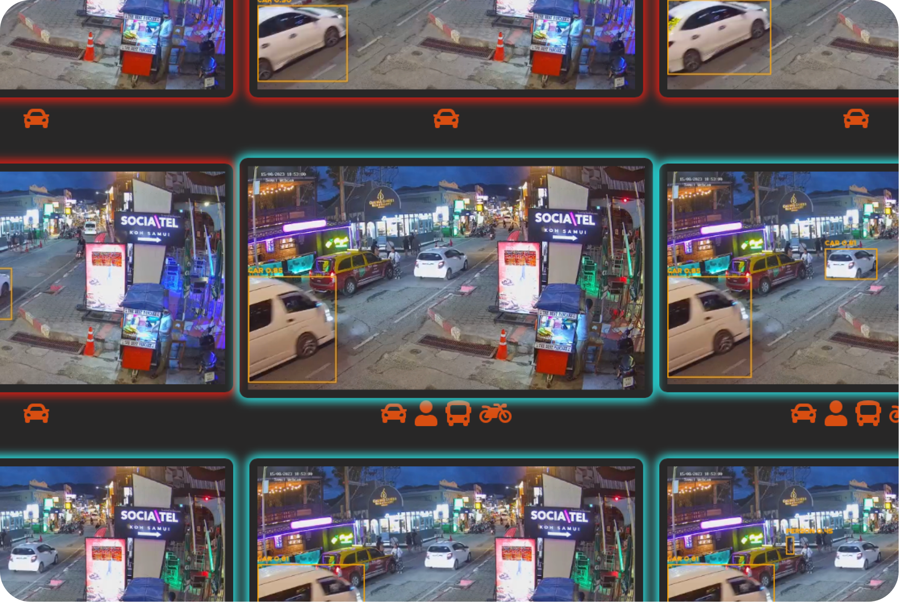

# Firescrew

Firescrew is a cutting-edge application written in Go that enables real-time object and motion detection from an RTSP network camera. It leverages advanced image processing techniques and machine learning models to identify specific objects such as cars, people, and more.

## Key Features
- **Real-Time Motion Detection**: Firescrew can detect motion from a live feed and provide real-time alerts.
- **Object Identification**: Identify specific objects like cars and people in real-time.
- **Model Flexibility**: Firescrew can use the built-in Go model SSD Mobilenet V1, or it can use the latest YOLOv8 model via a Python adapter for faster and more accurate detection. Additionally, it now supports EdgeTPU models, allowing for the use of Coral TPU for enhanced performance.
- **Performance**: Firescrew takes full advantage of Go's concurrency handling and speed, providing a high-performance solution for real-time image processing.
- **RTSP Network Camera Support**: Firescrew is compatible with RTSP network cameras, extending its applicability in a wide range of scenarios.

## Installation
### Docker * WORK IN PROGRESS *
```bash
docker run -v config.json:config.json 8ffOrg/firescrew:latest
```


### Local
Firescrew leverages the capabilities of `ffmpeg` to ensure optimal performance and broad compatibility, you will need to install them before use.
```bash
apt-get install ffmpeg
pip3 install ultralytics
curl -O firescrew -L https://github.com/8ff/firescrew/releases/download/latest/firescrew.linux.amd64 && chmod +x firescrew
```


## Usage
Create a template config file
```bash
./firescrew -t > config.json
```

Start object detection
```bash
./firescrew config.json
```

Starting WebUI
```bash
go run firescrew.go -s rec/hi :8080
```

## WebUI
- **Today & Yesterday:**
    - `today`
    - `today 8am`
    - `yesterday 3pm`
- **Specific Dates:**
    - `august 15th 10am`
    - `last friday 2pm`
- **Ranges:** Supports `from/to` and `between/and ranges`
    - `from july 7th 5pm to july 7th 6pm`
    - `last tuesday between 1pm and 2pm`
- **With Keywords:**
    - `people cars today between 10am and 1pm`
- **With Camera Name**
    - `front cars today`


* Background color of the events signify the same event to make it easier to separate them



## Demo
This will start a demo stream at `rtsp://localhost:8553/lo` and `rtsp://localhost:8554/hi`
```bash
cd demoStream && ./startDemoStream.sh
```

## Dependencies Installation for YOLOv8
If you choose to use the YOLOv8 model via the Python adapter for faster and more accurate detection, you will need to install the Ultralytics dependencies.
You can do this by running the following command:
```bash
    pip install ultralytics
```
Or, if your default Python version is 2.x, you may need to use pip3:
```bash
    pip3 install ultralytics
```
This command installs the Ultralytics package which includes the necessary dependencies for the YOLOv8 model.
If you encounter any problems during the installation, or you're looking for more advanced setup instructions, please refer to the [Ultralytics Quick Start Guide](https://docs.ultralytics.com/quickstart/).
Note: Make sure you have Python and pip (or pip3) installed on your system before running these commands. Ensure that your Python environment is properly set up and is compatible with the YOLOv8 model requirements.

## Dependencies Installation for EdgeTPU Coral
If you choose to use the EdgeTPU model via the Python adapter for faster and more accurate detection, you will need to install the Ultralytics dependencies.
You can do this by running the following command:
```bash
pip3 install tflite-runtime
pip3 install numpy
pip3 install Pillow
```

## RTSP Camera Stream URLs
Firescrew supports two different RTSP camera streams: a low resolution stream (`deviceUrl`) and a high resolution stream (`hiResDeviceUrl`). These streams are used for different purposes and should be set up accordingly.
The `deviceUrl` should be set to a low resolution video feed, typically around 640x360. This stream is used for motion detection. Note that the resolution of this stream significantly impacts the CPU usage. A higher resolution will lead to more CPU usage, so it is recommended to keep this stream at a lower resolution.
The `hiResDeviceUrl` should be set to a high resolution video feed, such as 1080p or higher. This stream is used to store video clips of motion events. As this stream is not used for motion detection, it can handle higher resolutions, enabling the capture of more detail in the recorded video clips.


## Configuration
Firescrew uses a JSON configuration file for its settings. Here is a brief explanation of the various configuration parameters:

```json
{
    "cameraName": "", // This will be used in the video file metadata to identify which camera the clip belongs to
    "deviceUrl": "", // URL of the low resolution video feed.
    "hiResDeviceUrl": "", // URL of the high resolution video feed.
    "useEmbeddedSSDMobileNetV1Model": false, // If true, modelFile and modelConfig dont need to be specified as the embedded version of SSDMobileNetV1 will be used.
    "modelFile": "", // Path to the .pb file of the model.
    "modelConfig": "", // Path to the .pbtxt file of the model configuration.
    "printDebug": false, // If true, debug information will be printed.
    "video": {
        "hiResPath": "", // Path where high-resolution videos are stored.
        "loResPath": "", // Path where low-resolution videos are stored.
        "recodeTsToMp4": true // To lower cpu usage, HI res clips are stored in original format, in order to play these clips in every browser, set this to true

    },
    "motion": {
        "objectMinThreshold": 0.3, // Minimum threshold for object detection. Range: 0.0 - 1
        "lookForClasses": [], // Array of classes that the model should look for. Typically: ["car", "truck", "person", "bicycle", "motorcycle", "bus", "cat", "dog", "boat"]
        "embeddedObjectDetector": true, // If true, embedded python Yolo8 server will be used
        "embeddedObjectScript": "objectDetectServerYolo.py", // Options are objectDetectServerYolo.py (YOLOV8) or objectDetectServerCoral.py (EdgeTPU Coral TPU)

        "networkObjectDetectServer": "", // Address of the network object detection server.
        "prebufferSeconds": 10, // Number of seconds to prebuffer before the motion event.
        "eventGap": 30 // Gap between events in seconds.
    },
    "pixelMotionAreaThreshold": 50.00, // Minimum pixel motion area for an event to be triggered and passed to object detection.
    "objectCenterMovementThreshold": 50.0, // For stationary objects, minimum distance the center of an object should move for an event to be be considered new.
    "objectAreaThreshold": 2000.0, // For stationary objects, difference in area of a bounding box to consider object as new.
    "ignoreAreasClasses": [
        // Array of classes and corresponding coordinates that should be ignored. Coordinates can be generated using getDimensions param.
        {"class": [], "coordinates": ""},
    ],
    "streamDrawIgnoredAreas": true, // If true, ignored areas will be drawn on the stream.
    "enableOutputStream": true, // If true, an output stream will be enabled.
    "outputStreamAddr": "" // Address of the output stream. Eg: 0.0.0.0:8050
}
```

## Performance
Firescrew's performance has been meticulously examined and optimized to ensure the fastest and most reliable object detection. The key aspects of this examination include comparing different RTSP feed methods and evaluating various model object detections. Here are the details:

### RTSP Feed Comparison
Three different methods for parsing RTSP feeds were tested:
- **GoCV RTSP Feed**: Utilized the GoCV library to handle RTSP feeds.
- **GoRTSP Feed**: Utilized the GoRTSP library for RTSP feed handling.
- **FFmpeg Command**: Employed FFmpeg commands to parse RTSP feeds.

Among these, using the FFmpeg command was found to be the fastest and most compatible between RTSP feeds. This approach not only delivered superior speed but also ensured broad compatibility across different types of RTSP feeds.

### Model Object Detection Comparison
Two primary models were examined for object detection:
- **Golang MobileNET**: This built-in Go model was tested for object detection capabilities.
- **YOLOv8**: The YOLOv8 model was examined via a Python adapter for faster and more accurate detection.

The comparison clearly revealed that YOLOv8 outperformed the Golang MobileNET in both speed and quality. The detection was faster, and the quality of object identification was much better with YOLOv8.

### Conclusion
Based on these comprehensive performance tests, Firescrew has adopted the use of the FFmpeg command for RTSP feed handling and the YOLOv8 model for object detection. This decision ensures the delivery of a fast, accurate, and high-quality solution for real-time object and motion detection. Additionally, the implementation of a network model adapter allows the support of any desired model detection, providing flexibility and adaptability for various use cases.


## Contribute Your Ideas
Your input is highly valued! If you have ideas for new features, enhancements, or anything else you'd like to see in Firescrew you can contribute your ideas and suggestions by:

- **Opening an Issue**: If you have a specific idea or request, please consider first using the discussion section as detailed below. For bugs or clearly defined enhancements, you can open a new issue in the GitHub repository. Be sure to describe your idea in detail so that it can be fully understood and considered.

- **Participating in Discussions**: Feel free to join existing discussions or start a new one in the discussion section of the repository. **This is the preferred place for sharing wishlists and brainstorming ideas.** By sharing your thoughts here, you can engage with other users, contribute to the ongoing development of Firescrew, and see your ideas evolve into implementable features.

Your insights and perspectives are vital in shaping the future of Firescrew. Together, we can make it even better! Discussions serve as a dynamic space for collaboration and creativity, and ideas from this section may well be selected for future implementation. Let's work together to continue to innovate and improve Firescrew.

**Stay Updated**: For the latest updates and news, please consider following [8ffChief on Twitter](http://twitter.com/8ffChief). Stay connected and be the first to know about new features, releases, and more!


## TODO
- Dockerfile
- GetDimensions Web UI
- Finish notifications via slack/email?
- Add benchmarks
- Event via external script
- Add uploading footage to cloud
- MQTT Events
- HA Integration
- Yaml Config ?
